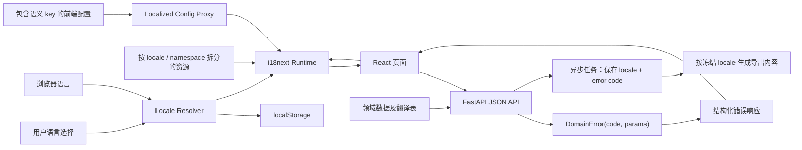

# BrickBuilder 多语言架构设计

> 状态：已批准的目标方案  
> 更新日期：2026-07-18  
> 强制变更入口：[I18N_CHANGE_GUARDRAILS.md](./I18N_CHANGE_GUARDRAILS.md)  
> 配套路线图：[I18N_ROADMAP.md](./I18N_ROADMAP.md)

本文件是仓库级架构决策记录。所有新功能、重构和修复只要涉及用户可见内容、API、异步任务、领域数据或导出，都必须先执行强制变更入口中的影响分类和完成检查，不允许建立第二套本地化机制。

## 1. 背景与目标

BrickBuilder 当前由 React/Vite 前端、FastAPI 后端、关系数据库、JSON 配置和异步计算任务组成。多语言能力不能只覆盖按钮和标题，还必须覆盖 API 错误、状态枚举、后台任务结果、验证报告、导出文件和需要本地化的领域数据。

本方案采用一次性目标架构调整，不设计旧文案兼容层，也不保留“原文作为翻译 key”的过渡模式。

目标：

- 首期支持 `zh-CN` 和 `en-US`，后续增加语言时不修改业务代码。
- 所有系统生成的用户可见内容由稳定语义 key 驱动。
- 业务状态、错误码和翻译文案相互独立。
- 前后端、异步任务和导出流程使用同一 locale 语义。
- 缺失翻译在开发和 CI 阶段失败，而不是在生产环境静默显示原文。
- 用户输入、技术标识和可翻译领域内容有清晰的数据边界。

非目标：

- 不自动翻译用户创建的项目名、组件名、标签或自由文本。
- 不在后端为普通 JSON API 直接渲染自然语言错误。
- 当前阶段不引入在线机器翻译服务或第三方翻译管理平台。
- 首期不实现 RTL 布局，但保留 locale 到书写方向的扩展点。

## 2. 当前基线

### 2.1 已完成

- 前端使用 `i18next`、`react-i18next` 和浏览器语言检测器。
- 支持 `zh-CN`、`en-US`，语言选择保存到 `brickBuilder.locale`。
- 配置展示字段已改为 `namespace:semantic.path`，通过只读 Proxy 按当前语言解析。
- 当前资源按 10 个 namespace 拆分，并包含独立的 `errors` 与 `tasks` 目录。
- 每种生产语言当前包含 749 个资源项，其中 204 个错误资源，并由测试校验 key、插值参数和 HTML 安全性。
- 页面切换语言时会触发应用重渲染；日期和数字格式使用当前 locale。
- 前端源代码已移除中文硬编码和旧的原文 key 回退逻辑。
- M1 已增加资源驱动的 TypeScript key/插值参数生成、开发伪语言、首页及六个关键业务页面双语言组件测试和浏览器视觉回归。
- M2 已完成 `DomainError`、统一错误 schema、全局异常处理、请求校验规范化、`traceId`、前端 `ApiError` 和全部公共 API 错误迁移。
- M3 已完成异步任务进度/错误、持久化解析/轮廓错误和组件验证 issue 的结构化，并在任务创建时冻结 locale/timezone。
- M4 已完成领域字段分类、组件/零件翻译表、已审核翻译选择、用户内容语言元数据、术语表和缺失翻译指标。
- M5 已完成版本化服务端导出词典、冻结导出上下文、本地化 LDraw/设计报告和 Unicode 安全文件名。
- M6 已完成 catalog/目录驱动的语言扩展、资源哈希与发布记录、负责人/PR 流程、运行时监控、`ja-JP` 验证和 RTL 评估。

关键实现：

- [frontend/src/i18n/index.ts](./frontend/src/i18n/index.ts)
- [frontend/src/i18n/localizedConfig.ts](./frontend/src/i18n/localizedConfig.ts)
- [frontend/src/i18n/resources/index.ts](./frontend/src/i18n/resources/index.ts)
- [frontend/src/i18n/__tests__/localizedConfig.test.ts](./frontend/src/i18n/__tests__/localizedConfig.test.ts)
- [frontend/src/i18n/PERFORMANCE.md](./frontend/src/i18n/PERFORMANCE.md)
- [backend/src/api/errors.py](./backend/src/api/errors.py)
- [backend/src/api/schemas/error.py](./backend/src/api/schemas/error.py)
- [frontend/src/api/client.ts](./frontend/src/api/client.ts)
- [backend/src/api/schemas/task.py](./backend/src/api/schemas/task.py)
- [backend/src/i18n/messages.py](./backend/src/i18n/messages.py)
- [frontend/src/api/taskContext.ts](./frontend/src/api/taskContext.ts)
- [I18N_FIELD_CLASSIFICATION.md](./I18N_FIELD_CLASSIFICATION.md)
- [backend/src/services/domain_content_service.py](./backend/src/services/domain_content_service.py)
- [backend/src/i18n/domain_content.py](./backend/src/i18n/domain_content.py)
- [backend/config/i18n_glossary.json](./backend/config/i18n_glossary.json)
- [backend/src/i18n/export_catalog.py](./backend/src/i18n/export_catalog.py)
- [backend/src/i18n/export_resources](./backend/src/i18n/export_resources)
- [backend/tests/test_export_i18n.py](./backend/tests/test_export_i18n.py)
- [I18N_GOVERNANCE.md](./I18N_GOVERNANCE.md)
- [I18N_RELEASE_NOTES.md](./I18N_RELEASE_NOTES.md)
- [I18N_LANGUAGE_EXPANSION_JA_JP.md](./I18N_LANGUAGE_EXPANSION_JA_JP.md)
- [I18N_RTL_ASSESSMENT.md](./I18N_RTL_ASSESSMENT.md)
- [frontend/src/i18n/catalog.json](./frontend/src/i18n/catalog.json)
- [frontend/scripts/check-i18n-resources.mjs](./frontend/scripts/check-i18n-resources.mjs)
- [backend/src/i18n/observability.py](./backend/src/i18n/observability.py)

### 2.2 待解决

- M0～M6 已全部落地。后续新增语言按治理文档进入翻译、审核和发布流程，不再需要新增架构里程碑。

## 3. 核心设计原则

1. **稳定 key，不稳定文案**：代码和数据只依赖语义 key，译文可以独立修改。
2. **机器数据不翻译**：`uploaded`、`draft`、`surface-plan` 等值保持稳定，由展示层映射。
3. **API 返回结构，不返回译文**：API 错误返回 `code + params`，前端负责展示语言。
4. **系统内容与用户内容分离**：系统文案必须本地化，用户原始输入默认原样展示。
5. **locale 必须显式**：浏览器、请求、异步任务和导出都使用规范化 BCP 47 locale。
6. **缺失即失败**：CI 检查语言资源对称性、非法 key 和未本地化展示文本。
7. **日志与 UI 分离**：日志保留可搜索的错误 code 和技术上下文，UI 不暴露内部异常文本。

## 4. 目标架构



### 4.1 Locale 解析

前端优先级：

1. 用户显式选择并保存在 `brickBuilder.locale` 的值。
2. 浏览器 `navigator.language`。
3. 默认 `zh-CN`。

所有输入必须规范化到支持列表。目前仅允许：

```text
zh, zh-CN, zh-Hans-* -> zh-CN
en, en-US, en-*      -> en-US
其他值                -> zh-CN
```

普通 API 不依赖语言返回业务数据。只有服务端生成自然语言产物时才读取标准 `Accept-Language`，并把最终解析后的 locale 写入任务记录，避免任务执行期间用户切换语言导致输出变化。

### 4.2 前端资源与 key 规范

目录结构：

```text
frontend/src/i18n/
├── index.ts
├── localizedConfig.ts
├── resources/
│   ├── index.ts
│   ├── zh-CN/
│   │   ├── common.json
│   │   └── <domain>.json
│   └── en-US/
│       ├── common.json
│       └── <domain>.json
└── __tests__/
```

key 使用 `namespace:semantic.path`：

```text
app:texts.appSubtitle
componentRepo:uploadProgress
partSearch:searchFailed
errors:auth.session.invalid
```

规则：

- namespace 表示业务所有权，不按页面组件层级随意拆分。
- key 表达业务语义，不包含中文或整句英文。
- 同一概念优先复用 key；不同上下文即使当前译文相同也应使用不同 key。
- 插值使用命名参数，例如 `errors:file.tooLarge` 配合 `{name, maxSize}`。
- 数量使用 i18next plural 规则，不在组件中拼接单复数。
- 展示配置只能保存合法翻译 key；运行时代理遇到原始展示文本直接报错。

### 4.3 API 错误契约

目标错误响应：

```json
{
  "error": {
    "code": "component_repo.import.not_found",
    "params": {
      "importId": "01H..."
    },
    "traceId": "req_01H..."
  }
}
```

后端领域层统一抛出：

```python
DomainError(
    code="component_repo.import.not_found",
    params={"importId": import_id},
    http_status=404,
)
```

FastAPI 全局异常处理器负责：

- 将 `DomainError` 转换为统一响应。
- 将 Pydantic 校验错误转换为稳定 validation code 和字段路径。
- 为未知异常返回 `common.internal_error`，原始异常只写日志。
- 生成并返回 `traceId`，便于 UI 报错与服务端日志关联。

前端统一 API client 负责：

- 解析错误响应为 `ApiError`。
- 使用 `errors:<code>` 和 `params` 渲染当前语言。
- 未知 code 显示统一 `errors:common.unknown`，同时记录 code 和 traceId。
- 禁止直接向用户展示 `response.statusText`、`response.text()` 或服务端堆栈信息。

不建议后端根据 `Accept-Language` 翻译普通错误响应，因为这会让缓存、日志、客户端重试和多端一致性变复杂。

### 4.3.1 异步任务契约

任务创建请求必须显式携带规范化后的 `locale` 和 IANA `timezone`；两者在创建时冻结，后续切换页面语言不会修改任务上下文。任务 API 不返回进度句子或失败句子：

```json
{
  "progress": {
    "percent": 42,
    "code": "terrain.progress.processing",
    "params": {"percent": 42}
  },
  "error": null,
  "locale": "zh-CN",
  "timezone": "Asia/Shanghai"
}
```

前端使用 `tasks:<code>` 渲染进度，使用 `errors:<code>` 渲染失败。持久化任务使用 `error_code + error_params_json`；解析、引用展开、轮廓生成和组件导入使用各自的 `*_error_code + *_error_params_json`，禁止保存原始异常文本。

### 4.4 状态、枚举与验证报告

所有状态保持机器值：

```text
uploaded
pending_review
published
blocked
```

前端用显式映射转换为 key：

```ts
const statusKeys = {
  uploaded: 'componentRepo:status.uploaded',
  pending_review: 'componentRepo:status.pendingReview',
} as const;
```

后端验证报告和解析问题使用结构化 issue：

```json
{
  "code": "component_repo.connector.overlap",
  "severity": "error",
  "params": {
    "connectorId": "C-12"
  },
  "path": ["interfaces", 3]
}
```

不得把最终译文写入 `status`、`failureReason`、`issues` 或元数据字段。

### 4.5 数据库存储边界

数据分为三类：

| 数据类型 | 示例 | 存储策略 |
|---|---|---|
| 机器数据 | 状态、类型、算法、错误 code | 保存稳定值或 code，不翻译 |
| 用户内容 | 项目名、组件名、自定义说明 | 保存原文，可选记录 `contentLocale` |
| 官方领域内容 | 零件名称、系统组件描述、帮助内容 | 使用领域专属翻译表 |

推荐为需要官方翻译的实体建立明确表，而不是通用 EAV 表：

```text
component_translations
- component_id
- locale
- name
- description
- updated_at
- translation_status
- reviewed_by
- reviewed_at

part_translations
- part_id
- locale
- name
- description
- updated_at
- translation_status
- reviewed_by
- reviewed_at
```

使用 `(entity_id, locale)` 唯一约束。API 只选择 `translation_status=reviewed` 的目标语言记录；缺失时只对官方领域内容回退主表源语言，同时返回实际 `contentLocale`、`translationStatus=fallback` 并累计指标。用户内容始终返回原文及其 `contentLocale`，不自动回退或机器翻译。

现有 `error_message`、`parse_error`、`profile_error` 等用户可见字段应直接改成：

```text
error_code
error_params_json
```

技术诊断文本进入日志或独立内部诊断字段，不通过公共 API 暴露。

### 4.6 异步任务与导出

创建任务时保存：

- `locale`
- `timezone`
- `catalogVersion`
- `error_code` / `error_params_json`

任务进度使用 `{percent, code, params}`，前端轮询后翻译。导出统一使用如下冻结上下文：

```json
{
  "locale": "zh-CN",
  "timezone": "Asia/Shanghai",
  "catalogVersion": "brickbuilder-export-2026.07.18.1"
}
```

- LEGO 异步任务在创建时将上下文写入 job，LDraw 与设计计划下载只读取该 job。
- DEM 最终设计请求同样携带任务上下文；服务端把规范化后的 `exportContext` 写回设计结果，后续 LDraw 和报告复用它。
- 服务端导出词典位于 `backend/src/i18n/export_resources`，词典版本同时写入任务响应、JSON 文档元数据和 LDraw 注释。已发布版本的词典内容不得原地修改；文案变更需要新版本。
- JSON 属性名、枚举、ID、数值和 BOM 数据保持机器契约，不翻译；面向用户的标题、说明、章节名、字段标签、层名和步骤名放入本地化 `document` 元数据或 LDraw 注释。
- 下载文件名由词典模板生成，模板参数先移除路径/平台非法字符；`Content-Disposition` 同时提供 ASCII fallback 与 RFC 5987 UTF-8 `filename*`。
- 用户上传源文件、原始模型和组件源代码属于原始内容下载，不进行翻译或重命名。

### 4.7 时间、数字、单位和排序

- 日期使用 `Intl.DateTimeFormat(locale, options)`。
- 数字使用 `Intl.NumberFormat(locale, options)`。
- 单位使用结构化数值和单位 code，不在 API 中拼接文本。
- 相对时间使用 `Intl.RelativeTimeFormat`。
- 用户可排序文本使用 `Intl.Collator(locale)`。
- API 时间统一传 ISO 8601 UTC；前端根据用户时区显示。

### 4.8 缓存与性能

当前两种语言、每种 740 个资源项可继续启动时加载。达到以下任一条件后切换为 namespace 懒加载：

- 单语言资源压缩后超过 100 KB。
- 支持语言超过 4 种。
- 首屏翻译资源对加载性能产生可测量影响。

资源静态打包时由构建 hash 负责缓存失效。若后续使用远程翻译资源，则以 `locale + namespace + catalogVersion` 作为缓存键。

### 4.9 治理、版本与可观测性

- `catalog.json` 是前端 locale、alias、RTL 语言和资源版本的唯一运行时清单；资源目录通过构建工具自动发现。
- CI 校验全部生产语言的 namespace/key/插值参数集合、语义 key、非法 HTML、内容 SHA-256 和发布说明。
- 未审核语言只登记在 `validationLocales`；加入 `productLocales` 前必须补齐资源、服务端导出词典和官方领域翻译。
- 前端对未知 key、未知 API code 和不支持 locale 回退做会话内去重上报。
- 服务端限制单字段长度和最大维度数，按 UTC 小时聚合；`/api/i18n/metrics` 返回总量、维度和趋势，Dashboard 展示核心健康指标。
- catalog version 发布后不可复用；资源变更必须升级版本、hash 和发布说明。

## 5. 测试与质量门禁

CI 必须包含：

- 每个 locale 的 namespace 和 key 集合完全一致。
- 所有源代码和展示配置引用的 key 均存在。
- 展示配置中没有原始自然语言文本。
- 前端页面源代码没有未豁免的用户可见硬编码文本。
- API 错误 schema 契约测试。
- 每个 `DomainError.code` 在错误资源中存在。
- 每个任务进度 code 在 `tasks` 资源中存在，任务数据不随展示语言变化。
- 持久化错误模型不存在最终文案列，验证 issue 符合统一结构化 schema。
- 状态枚举均有翻译映射。
- 插值参数在所有语言中一致。
- 关键页面在 `zh-CN`、`en-US` 下执行组件或端到端测试。
- 日期、数字、复数和长文本布局测试。

建议增加 `en-XA` 伪语言，用加长字符暴露布局溢出和遗漏硬编码；RTL 语言上线前再增加 `ar-XB`。

## 6. 可观测性与安全

- 日志记录 `errorCode`、`traceId`、路由、实体 ID，不依赖译文搜索。
- 统计缺失翻译 key、未知 API code 和回退语言命中次数。
- 禁止把数据库异常、文件路径、SQL、鉴权服务响应正文直接展示给用户。
- 翻译插值默认 HTML 转义；不得在翻译资源中嵌入未经审计的 HTML。
- 用户内容和翻译资源分开处理，避免把用户输入误当作 key 或模板。

## 7. 翻译协作流程

1. 开发者先定义语义 key、中文和英文基准文案。
2. CI 验证 key、参数和 namespace 完整性。
3. 产品或翻译人员只修改资源值，不修改 key。
4. 评审同时检查术语一致性、上下文和长文本布局。
5. 合并后资源随应用版本发布；关键导出记录 catalog version。

术语表至少覆盖：LEGO、Brick、Plate、Stud、LDraw、DEM、Component、Connector、Interface、Draft、Publish 等领域词汇。

## 8. 关键架构决策

| 决策 | 选择 | 原因 |
|---|---|---|
| 前端框架 | i18next + react-i18next | 已落地，支持 namespace、复数和插值 |
| key 形式 | `namespace:semantic.path` | 稳定、可审计、与原文解耦 |
| API 错误 | code + params | 多端一致、可观测、避免后端文案耦合 |
| 普通 API 本地化 | 客户端翻译 | 缓存和日志更稳定 |
| 官方动态内容 | 领域专属翻译表 | 强约束、可查询、避免 EAV 复杂度 |
| 用户内容 | 原文保存 | 尊重输入，不隐式机器翻译 |
| 缺失翻译 | CI 失败 | 项目尚未生产，可直接采用严格最终方案 |
| 旧接口兼容 | 不提供 | 当前无生产流量和迁移约束 |

## 9. 完成定义

系统达到完整多语言支持需同时满足：

- 所有系统生成的用户可见内容均由语义 key 或本地化领域数据产生。
- API 不返回需要直接展示的自然语言错误。
- 后台任务不保存最终错误译文。
- 中英文关键业务流程通过自动化和视觉验收。
- 新增语言只需新增资源、领域翻译数据和 locale 配置，不修改业务流程代码。
