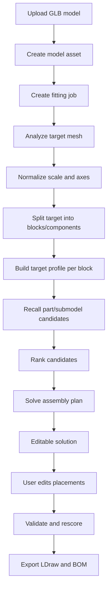

# 3D 模型自动拼搭方案实施计划

## 目标

构建一个可交互的 3D 模型拼搭工作流：

1. 用户在界面上传 3D 模型。
2. 用户点击生成 model。
3. 后端读取模型并拆解为可拟合的目标组件。
4. 系统基于尺寸、外观、连接点和不规则零件策略召回 part/submodel。
5. 系统生成一个可检查、可编辑、可再次生成的拼搭方案。
6. 用户可以在界面中编辑最终方案，并导出 LDraw/BOM。

关键原则：最终拼搭方案必须是可编辑的方案文档，而不是一次性黑盒输出。

## 当前已有能力

### 3D 模型上传

状态：已完成第一版。

已有能力：

- `POST /api/mesh-models` 支持上传 `.glb`。
- 上传文件会保存到 `data/imported_mesh_models`。
- 上传记录会写入 `model_assets`。
- 已能提取 GLB 材质颜色摘要。
- 已有 `GET /api/mesh-models/{model_id}/file` 读取原始模型文件。

当前限制：

- 只支持 GLB。
- 只提取颜色摘要，没有生成几何 bbox、体素、切片或组件分解。
- 没有与后续 fitting job 关联。

### LDraw 零件数据

状态：已有基础数据。

已有能力：

- `ldraw_parts` 存储 part 编号、名称、类别和路径。
- `ldraw_part_geometry` 存储 bbox、logical size、顶点/面等解析结果。
- `connector_instances` 存储连接点类型、性别、位置和方向。
- `ldraw_part_shape_profiles` 存储 part 的 surface/collision/connection profile。

当前限制：

- shape profile 还不是全量。
- 不规则零件中一部分被标记为 failed，例如 `non_grid_dimension`。
- 还没有用于目标模型拟合的统一几何精排数据。

### Fitting Candidate Profile

状态：part 已完成第一版，submodel 已完成代码路径。

已有能力：

- `fitting_candidate_profiles` 统一存储 part/submodel 候选摘要。
- part candidate 可以由 ready shape profile 生成。
- submodel candidate 可以由 submodel parts、连接点、颜色比例和备注生成。
- submodel candidate 已支持 failed profile 追踪。
- submodel source metadata 已包含 `partSummary`，支持按 part/category/color 聚合。

当前真实数据状态：

- 已生成过 50 个真实 part candidate。
- 当前真实数据库没有 submodel 行，所以没有真实 submodel candidate。

### Candidate Recall API

状态：已完成第一版。

已有入口：

- `POST /api/fitting/candidates/recall`

已有能力：

- 按 `candidateTypes` 召回 part/submodel。
- 按 bbox 尺寸召回。
- 按 logical size 召回。
- 按 connector type/gender/minCount 召回。
- 按 category 召回。
- 按 color code 召回。
- 支持 `includeIrregular=true` 召回 `non_grid_dimension` failed part 作为降级候选。

当前限制：

- 还没有 query log。
- 还没有与目标 3D 模型 block 绑定。
- 还没有精排评分、碰撞检测、连接稳定性评分。

### Submodel

状态：已有存储和 candidate profile。

已有能力：

- `POST /api/submodels` 创建可复用 submodel。
- submodel 使用 LDraw 内容描述组成零件、颜色和连接点。
- submodel 支持备注。
- submodel candidate profile 可用于召回。

当前限制：

- 真实数据库暂无 submodel 数据。
- 备注还没有结构化成外观/用途标签。
- submodel 没有完整几何融合 profile。

## 目标工作流

## 可编辑拼搭方案要求

### 方案必须持久化

最终方案不能只作为一次 API 响应返回，必须保存为可编辑对象。

建议对象：

- `model_fitting_jobs`
- `model_fitting_target_blocks`
- `model_fitting_solutions`
- `model_fitting_solution_placements`
- `model_fitting_solution_edits`

### 方案核心数据

每个 solution 应包含：

- `solutionId`
- `jobId`
- `sourceModelId`
- `status`
- `version`
- `targetMetrics`
- `coverageMetrics`
- `collisionMetrics`
- `connectionMetrics`
- `bom`
- `ldrawContent`
- `createdAt`
- `updatedAt`

每个 placement 应包含：

- `placementId`
- `solutionId`
- `targetBlockId`
- `candidateType`
- `candidateId`
- `ldrawPartNum` 或 `submodelId`
- `colorCode`
- `position`
- `orientation`
- `bbox`
- `score`
- `scoreReasons`
- `locked`
- `source`

`source` 用来区分：

- `generated`
- `user_added`
- `user_replaced`
- `user_moved`
- `user_removed`

### 必须支持的编辑操作

第一版必须支持：

- 替换某个 block 的候选零件。
- 移动 placement。
- 旋转 placement。
- 修改颜色。
- 删除 placement。
- 锁定 placement，后续重新生成时不覆盖。
- 对未覆盖 block 重新召回候选。
- 对局部区域重新生成。

后续支持：

- 添加自定义 placement。
- 把一组 placement 保存为 submodel。
- 拆开 submodel。
- 合并多个 block。
- 手工标记某个候选为不适合。
- undo/redo。

### 编辑后的验证

每次编辑后需要重新计算：

- 覆盖率。
- 与目标模型的误差。
- placement 之间的碰撞。
- 连接点匹配情况。
- BOM 数量和颜色。
- 是否存在悬空或弱连接。

第一版可以只做轻量验证：

- bbox 是否明显超出目标范围。
- 是否与其他 placement bbox 重叠。
- BOM 是否可计算。
- LDraw 是否可导出。

## 需要新增的后端能力

### M1：Model Fitting Job

状态：完成后端第一版。

目标：

- 接收已上传的 mesh model。
- 创建 fitting job。
- 返回 job 状态和第一版分析结果。

建议 API：

- `POST /api/model-fitting/jobs`
- `GET /api/model-fitting/jobs/{job_id}`
- `GET /api/model-fitting/jobs/{job_id}/blocks`

第一版 job 不直接承诺生成最终拼搭模型，只做模型分析和候选召回。

当前已完成：

- 新增 `backend/config/model_fitting.json`。
- 新增 `model_fitting_jobs`。
- 新增 `POST /api/model-fitting/jobs`。
- 新增 `GET /api/model-fitting/jobs/{job_id}`。
- 新增 `GET /api/model-fitting/jobs/{job_id}/blocks`。
- 创建 job 时会读取已上传 mesh model，执行 GLB 几何分析。
- 创建 job 时会生成 whole-model target block。
- 创建 job 时会生成 draft editable solution shell。

### M2：Target Mesh Analysis

状态：完成后端第一版。

目标：

- 解析 GLB mesh 顶点和三角面。
- 计算整体 bbox。
- 计算材质/颜色分布。
- 计算基础面数、体积估计、表面积估计。

需要输出：

- `targetBBox`
- `colorSummary`
- `meshStats`
- `normalization`

当前已完成：

- 新增 `backend/src/mesh/glb_geometry.py`。
- 支持读取 GLB JSON chunk。
- 支持使用 POSITION accessor 的 min/max 计算 bbox。
- 支持在 accessor 没有 min/max 时读取 BIN chunk 中的 POSITION 数据。
- 支持统计 meshCount、primitiveCount、vertexCount、triangleCount。

### M3：Scale and Axis Normalization

状态：部分完成。

目标：

- 把任意 GLB 坐标映射到 LDraw/LEGO 坐标。
- 明确模型的宽、深、高方向。
- 明确模型落地面。
- 支持用户在 UI 上调整 scale。

决策点：

- 自动推断 scale 还是用户输入目标尺寸。
- 默认一 stud 对应多少模型单位。
- Y 轴向上还是 Z 轴向上。

当前已完成：

- fitting job 请求支持 `scaleToLdu`。
- 未传 `scaleToLdu` 时使用 `model_fitting.json` 中的默认值。
- job response 会输出 `targetBBox` 和 `normalizedBBox`。

仍未完成：

- UI 中还不能交互调整 scale。
- 还没有自动推断模型单位。
- 还没有落地面检测。
- 还没有轴向重映射。

### M4：Target Block Decomposition

状态：完成 vehicle-8-wide 后端第一版。

目标：

- 把目标模型拆成可拟合 block。
- 每个 block 可以生成 recall query。

第一版策略：

- 使用规则 voxel/grid 分块。
- 优先按 bbox 和颜色分块。
- 不做复杂语义拆解。

当前已完成：

- 新增 `vehicle-8-wide` semantic preset。
- 创建 job 时支持 `modelTypeHint=vehicle`。
- 创建 job 时支持 `semanticPreset=vehicle-8-wide`。
- 创建 job 时支持 `targetWidthStud=8`，并可反推 `scaleToLdu`。
- 车辆 preset 会生成 chassis、frontBody、rearBody、cabin、roof、leftSide、rightSide、四个 wheelAssembly、frontDetail、rearDetail。
- 每个 vehicle block 保存 semanticType、semanticSource、semanticConfidence、shapeHints、reuseGroup、symmetryGroup。
- 每个 vehicle block 会生成 bbox recall query 和 candidateSummary。

当前限制：

- 车辆分块使用 preset bbox fraction，不是真实语义识别。
- 尚未自动识别车轮圆柱几何。
- 尚未自动判断车头方向。
- 尚未生成多套 split proposal。

后续策略：

- 连通体分割。
- 曲率/法线聚类。
- 按颜色区域拆分。
- 按结构稳定性拆分。

### M5：Target Block Profile

状态：未开始。

目标：

- 为每个 block 生成目标 profile。

第一版字段：

- `blockId`
- `bbox`
- `logicalSize`
- `colorHint`
- `categoryHint`
- `connectorRequirements`
- `surfaceSummary`

### M6：Candidate Recall Integration

状态：部分完成。

已有：

- `/api/fitting/candidates/recall`

待做：

- 从 block profile 自动构造 recall request。
- 保存每个 block 的候选召回结果。
- 记录召回耗时和候选数量。
- 记录候选为什么被召回。

当前已完成：

- whole-model target block 会自动构造 bbox recall request。
- 创建 job 时会调用 `/api/fitting/candidates/recall` 对 whole-model block 做第一轮召回。
- block 中会保存 `recallQuery` 和 `candidateSummary`。

仍未完成：

- 多 block 的 recall。
- query log 表。
- 召回耗时记录。

### M7：Assembly Solver

状态：未开始。

目标：

- 从每个 block 的候选列表中选出一个或多个 placement。
- 输出初始 solution。

第一版策略：

- 贪心选择最高分候选。
- 优先选择 bbox 接近、颜色接近、连接点满足的候选。
- 支持 locked placement。

后续策略：

- beam search。
- 局部回溯。
- 碰撞约束。
- 连接稳定性约束。
- submodel 复用奖励。

### M8：Editable Solution API

状态：部分完成。

建议 API：

- `POST /api/model-fitting/jobs/{job_id}/solutions`
- `GET /api/model-fitting/solutions/{solution_id}`
- `PATCH /api/model-fitting/solutions/{solution_id}/placements/{placement_id}`
- `POST /api/model-fitting/solutions/{solution_id}/placements`
- `DELETE /api/model-fitting/solutions/{solution_id}/placements/{placement_id}`
- `POST /api/model-fitting/solutions/{solution_id}/regenerate`
- `POST /api/model-fitting/solutions/{solution_id}/validate`
- `GET /api/model-fitting/solutions/{solution_id}/ldraw`
- `GET /api/model-fitting/solutions/{solution_id}/bom`

必须满足：

- 每次编辑创建新 version 或 edit log。
- 用户锁定的 placement 不被自动覆盖。
- 局部 regenerate 只影响指定 block/区域。

当前已完成：

- 新增 `model_fitting_solutions`。
- 新增 `model_fitting_solution_placements`。
- 新增 `model_fitting_solution_edits`。
- 创建 job 时会创建 draft solution。
- 新增 `GET /api/model-fitting/solutions/{solution_id}`。

仍未完成：

- placement 新增、修改、删除 API。
- edit log 写入。
- version 增量。
- locked placement 的 regenerate 保护。
- solution validate。

### M9：Frontend Fitting Workspace

状态：未开始。

页面目标：

- 上传 GLB。
- 显示模型预览。
- 设置 scale 和方向。
- 点击 Generate Model。
- 查看分块。
- 查看每个 block 的候选。
- 编辑拼搭方案。
- 导出 LDraw/BOM。

第一版界面区域：

- 左侧：模型和生成设置。
- 中间：3D 预览和 placement 编辑。
- 右侧：选中 block/placement 的候选列表、评分原因、替换按钮。
- 底部：job 进度、验证错误、BOM 摘要。

## 不规则零件策略

### 当前策略

- `non_grid_dimension` 零件不进入 ready candidate。
- `includeIrregular=true` 时作为 degraded candidate 召回。
- 返回时必须显示失败原因和降级来源。

### 为什么这样做

不规则零件通常几何难以标准化：

- 尺寸不对齐 stud grid。
- 曲面、斜面、装饰或复杂细节多。
- mesh union 和 surface profile 容易失败或代价过高。

直接让它们进入主候选池会降低自动拼装质量。更合理的是先让它们作为补充候选出现，再在精排或人工编辑中使用。

### 后续改进

- 为 `non_grid_dimension` 生成 approximate bbox profile。
- 为装饰件生成 appearance-only profile。
- 为曲面件生成 normal histogram profile。
- 为特殊连接件单独建 connector-first profile。
- 在 UI 中把不规则候选显示为“特殊候选”，并要求用户确认。

## 完成事项跟踪

| 模块 | 状态 | 说明 |
| --- | --- | --- |
| GLB 上传 | 完成第一版 | 可保存模型并提取颜色摘要 |
| ModelAsset 存储 | 完成第一版 | 可记录上传模型 |
| LDraw part geometry | 完成基础版 | 已有 bbox/logical size/connector 基础数据 |
| Part shape profile | 进行中 | 已有 pilot，不是全量 |
| Failed shape profile 分类 | 完成第一版 | 已有 `non_grid_dimension` |
| Fitting candidate profile | 完成第一版 | part/submodel 统一候选摘要 |
| Submodel 存储 | 完成第一版 | 真实库仍缺 submodel 数据 |
| Submodel candidate profile | 完成代码路径 | 真实库暂无 submodel candidate |
| Candidate recall API | 完成第一版 | 支持尺寸、连接点、类别、颜色、不规则降级 |
| Model fitting job | 完成后端第一版 | 可创建 job、保存 whole-model block 和 draft solution |
| Target mesh analysis | 完成后端第一版 | 可解析 GLB bbox 和 meshStats |
| Scale/axis normalization | 部分完成 | 后端支持 `scaleToLdu`，vehicle-8-wide 可用 `targetWidthStud=8` 反推 scale，UI 和轴向调整未完成 |
| Target block decomposition | 完成 vehicle 后端第一版 | `vehicle-8-wide` 可生成语义区域 blocks |
| Target block profile | 部分完成 | whole-model 和 vehicle blocks 已能生成 bbox recall query |
| Assembly solver | 未开始 | 需要生成初始 solution |
| Editable solution API | 部分完成 | 已有 solution/placement/edit 表和 solution 查询，编辑操作未完成 |
| Fitting workspace UI | 未开始 | 需要上传、生成、编辑、导出 |
| LDraw/BOM export | 未开始 | 需要从 solution 生成 |
| Query/job logs | 未开始 | 需要记录召回数量、耗时、失败原因 |

## 推荐下一步

下一步优先做两个方向：

1. 前端 `3D Fitting` 工作台页面：上传 GLB、选择 `vehicle-8-wide`、创建 fitting job、显示 target bbox、meshStats、vehicle blocks、candidateSummary 和 draft solution。
2. Editable solution placement API：支持用户新增、替换、移动、旋转、改色、删除和锁定 placement，并写入 edit log。

这两步完成后，系统就不只是后端分析工具，而是具备“生成后可编辑”的产品闭环。随后再推进多 block decomposition 和 assembly solver。

## 开放决策

- 第一版是否只支持 GLB。
- scale 是自动推断，还是由用户输入目标宽/深/高。
- 第一版 block decomposition 使用多大 voxel/grid。
- 初始拼装是否允许使用不规则候选。
- solution 编辑是否每次都创建 version。
- LDraw 导出是否必须保留用户编辑历史。
- submodel 是仅作为候选使用，还是允许用户把编辑结果保存成新 submodel。
