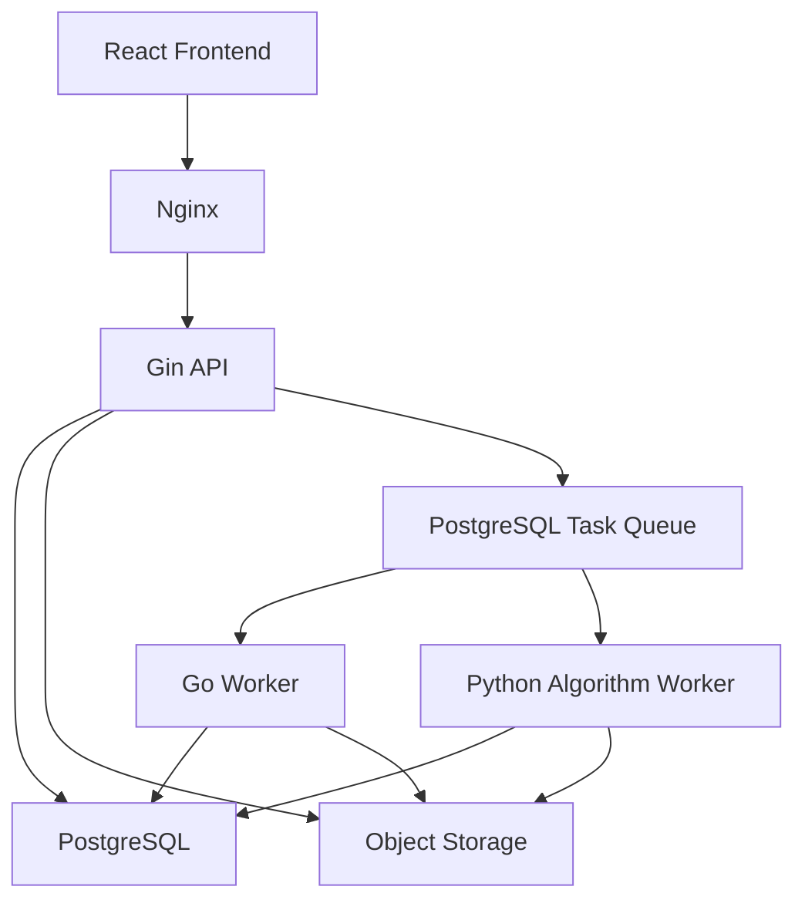

# Component Repo Go 迁移路线与实施计划

> 状态：Ready for implementation
> 更新日期：2026-08-06
> 原则：[go_backend_migration_principles.md](./go_backend_migration_principles.md)
> 进度：[go_migration_progress.md](./go_migration_progress.md)
> G2 schema 决策：[go_component_schema_baseline.md](./go_component_schema_baseline.md)

## 1. 范围与假设

本计划将 Component Repo 的公共 API、事务编排、数据访问、对象存储编排和任务管理迁移到 Go。

当前项目没有生产流量，因此：

- 不保留旧 FastAPI 组件 API 兼容性。
- 前端直接切换到新 `/api/v1` 契约。
- 开发数据库允许通过单独确认后的 reset/reseed 采用新 schema baseline。
- 新实现不支持 MySQL。
- Python 只保留 Worker 算法插件，不再承载迁移完成后的组件公共 API。

不在首轮范围：

- 将所有科学计算或复杂 3D 算法改写成 Go；
- 拆分组件微服务或开发业务网关；
- 引入独立消息中间件；
- 生产灰度、双写和历史客户端兼容。

## 2. 目标运行架构



第一阶段可以单实例运行，但 API 和 Worker 从代码结构上必须独立启动、独立扩容。

## 3. 目标工程结构

```text
backend-go/
├── cmd/
│   ├── api/main.go
│   ├── worker/main.go
│   └── migrate/main.go
├── internal/
│   ├── component/
│   │   ├── handler.go
│   │   ├── service.go
│   │   ├── dto.go
│   │   └── errors.go
│   ├── task/
│   ├── auth/
│   ├── storage/
│   ├── i18n/
│   ├── config/
│   └── observability/
├── db/
│   ├── migrations/
│   ├── queries/
│   └── generated/
├── sqlc.yaml
├── go.mod
└── Makefile
```

## 4. 目标领域与数据边界

### 4.1 核心表组

组件目录与版本：

```text
components
component_versions
component_translations
```

个人仓库：

```text
component_groups
component_group_memberships
component_subscriptions
```

导入与资产：

```text
artifacts
component_imports
component_scene_snapshots
```

结构理解：

```text
component_candidates
component_relation_candidates
component_assembly_relations
component_interfaces
component_validation_reports
```

任务：

```text
tasks
task_events
outbox_events
```

首轮 schema 可以保留稳定扩展字段为 `jsonb`，但所有权、状态、版本关系、artifact 关系、任务 lease、错误 code 和 locale/timezone 必须为显式列。

### 4.2 不变量

- 原始 `.io/.ldr/.mpd` artifact 不可覆盖，必须保存 SHA-256。
- 发布后的 ComponentVersion 结构不可修改。
- ComponentGroup 是用户视图，不复制或改变 Component 所有权。
- 根分组不保存本地化名称。
- 用户内容保留原文和 `contentLocale`。
- 官方 Component/Part 只读取 `reviewed` 翻译。
- 场景快照是结构权威数据，GLB 是可重建派生数据。
- Transform 不得被连接识别自动改写。
- 单容量 connector 不得被多个已确认关系占用。

## 5. 新 API 草案

### 5.1 Component 与版本

```text
GET    /api/v1/components
POST   /api/v1/components
GET    /api/v1/components/:componentId
PATCH  /api/v1/components/:componentId
DELETE /api/v1/components/:componentId

GET    /api/v1/components/:componentId/versions
POST   /api/v1/components/:componentId/versions
GET    /api/v1/component-versions/:versionId
DELETE /api/v1/component-versions/:versionId
POST   /api/v1/component-versions/:versionId/publish
POST   /api/v1/component-versions/:versionId/deprecate
POST   /api/v1/component-versions/:versionId/archive
GET    /api/v1/component-versions/:versionId/parts
GET    /api/v1/component-versions/:versionId/source
```

### 5.2 分组与订阅

```text
GET    /api/v1/component-groups
POST   /api/v1/component-groups
PATCH  /api/v1/component-groups/:groupId
DELETE /api/v1/component-groups/:groupId
POST   /api/v1/component-groups/:groupId/move

GET    /api/v1/component-groups/:groupId/components
POST   /api/v1/component-groups/:groupId/components
DELETE /api/v1/component-groups/:groupId/components/:componentId

PUT    /api/v1/components/:componentId/subscription
DELETE /api/v1/components/:componentId/subscription
```

### 5.3 导入、候选和任务

```text
POST   /api/v1/component-imports/upload-sessions
POST   /api/v1/component-imports/upload-sessions/:sessionId/complete
GET    /api/v1/component-imports/:importId

GET    /api/v1/component-candidates/:candidateId
GET    /api/v1/component-candidates/:candidateId/relations
POST   /api/v1/component-candidates/:candidateId/relations/detect
POST   /api/v1/component-candidates/:candidateId/relations/:relationId/confirm
POST   /api/v1/component-candidates/:candidateId/relations/:relationId/reject
GET    /api/v1/component-candidates/:candidateId/connectors
POST   /api/v1/component-candidates/:candidateId/validate

GET    /api/v1/tasks/:taskId
POST   /api/v1/tasks/:taskId/cancel
```

上传完成返回 `202 Accepted`：

```json
{
  "importId": "...",
  "taskId": "...",
  "status": "queued"
}
```

API DTO 在实现前可以继续细化；本计划不要求保持旧字段兼容。

## 6. 任务类型与 Worker 路由

首批任务类型：

| taskType | 初始执行者 | 目标 |
|---|---|---|
| `component.import.parse` | Python Worker | 复用现有解析能力，后续评估迁入 Go |
| `component.relations.detect` | Python Worker | 复用现有连接识别，协议先稳定 |
| `component.validate` | Go Worker | 规则型验证优先进入 Go |
| `component.preview.materialize` | Go Worker | 生成编排与对象存储写入 |
| `component.artifact.verify` | Go Worker | 大小、hash 和元数据校验 |

Python Worker 只消费任务和写入结构化结果，不提供公共组件 HTTP 路由。

## 7. 迁移阶段

### G0：原则、路线与工程决策

目标：固定迁移方向和执行边界。

交付：

- Go 后端迁移原则；
- Component Repo 路线图；
- 进度台账；
- 仓库级代理必读规则。

验收：文档互相链接，进度只记录事实，不把计划标记为完成。

### G1：Go 工程骨架

目标：建立可运行、可测试、可生成代码的 Go 模块。

交付：

- `backend-go/go.mod`；
- Gin API 与 `/health/live`、`/health/ready`；
- 配置加载与启动校验；
- 结构化日志、trace ID、recovery、超时和统一错误响应；
- pgxpool 初始化、Ping 和优雅关闭；
- sqlc 与 Goose 配置；
- API、Worker、migration 独立入口；
- 基础单元测试和 CI 命令。

验收：

- API 和 Worker 可独立启动与关闭；
- 数据库不可用时 readiness 失败；
- panic 不泄露堆栈到响应；
- `sqlc generate` 和 migration dry run 可执行。

### G2：PostgreSQL schema baseline

目标：建立由 Go 工程拥有的干净数据库基线。

交付：

- 清点现有 Component Repo 表、约束、索引和 RLS；
- 确定保留、合并、重命名和删除项；
- 编写 Goose baseline；
- 编写 sqlc query schema 输入；
- PostgreSQL 集成测试；
- 将 `component_repo` schema 的 authority 从 Alembic 边界中剥离并交给 Goose；legacy `public` 域暂由 Alembic 管理；
- 开发数据 reset/reseed runbook。

验收：

- 空 PostgreSQL 可以从零升级到 head；
- schema 与 sqlc 生成结果一致；
- API/Worker 启动不执行 DDL；
- 交接后不再新增或修改任何触及 `component_repo` 的 Alembic revision。

注意：任何实际 drop/reset 必须在执行前确认数据库目标，不能仅凭本计划自动执行。

### G3：组件目录、版本和分组

目标：完成不依赖重计算的组件主业务闭环。

交付：

- Component CRUD；
- ComponentVersion 查询、创建草稿和生命周期；
- ComponentGroup 树、移动和成员关系；
- ComponentSubscription；
- owner/actor 授权；
- 官方翻译选择和用户 `contentLocale`；
- 列表过滤、分页和稳定排序。

验收：

- 所有写操作具有事务测试；
- 跨用户查询和写入被拒绝；
- 分组循环、深度、同级唯一性和排序约束通过；
- 发布版本不可变；
- API 错误只有 `code + params + traceId`。

### G4：Artifact 与上传会话

目标：让 Gin 可靠管理源文件元数据和客户端直传。

交付：

- Storage interface 与 Supabase/S3-compatible adapter；
- 上传会话；
- 服务端生成 owner-scoped object key；
- HEAD/metadata 校验；
- artifact immutable 规则；
- 下载/签名 URL；
- 部分失败补偿和过期上传清理。

验收：

- 客户端不能指定可信完整 Storage key；
- 上传完成不重复下载正文；
- hash 在唯一必要正文读取中验证；
- 原始 artifact 不被派生 artifact 替代或覆盖。

### G5：持久化任务系统

目标：所有组件长任务脱离 API 进程。

交付：

- `tasks`、`task_events`、`outbox_events`；
- 创建、领取、续租、完成、失败、取消和重试；
- 幂等 key 与最大尝试次数；
- progress/error `code + params`；
- locale/timezone 冻结；
- Go Worker 执行框架；
- Python Worker 语言无关消费协议。

验收：

- Worker 崩溃后 lease 到期可恢复；
- 同一幂等任务不会生成重复业务结果；
- 任务重试不重复创建 artifact 或版本；
- API 重启不丢失任务。

### G6：组件导入、解析与候选流程

目标：完成上传到可审核 Candidate 的异步闭环。

交付：

- upload complete 原子创建 import 与 parse task；
- Python parser Worker adapter；
- scene snapshot、BOM 和 parse issues 写入；
- Candidate 与 Draft ComponentVersion；
- 结构化失败和重试；
- parser version 与 part library version 冻结。

验收：

- API 请求不执行文件解析；
- 同一 import 重试不会覆盖历史快照；
- 用户切换语言不改变任务上下文；
- parse issue 不保存最终译文或异常正文。

### G7：关系、接口、校验和预览

目标：补齐 Component Repo 工作台所需的结构理解能力。

交付：

- relation detection task；
- confirm/reject transaction；
- free connector 与 external interface；
- validation task/report；
- version-addressed GLB materialize task；
- signed preview URL 和 locale-aware Part BOM 分离加载。

验收：

- Transform 不被检测逻辑修改；
- connector capacity 和关系唯一性由数据库/事务保证；
- 验证失败阻止发布；
- GET 不隐式生成 GLB；
- 缓存丢失可以幂等重建。

### G8：前端切换与 Python 组件 API 删除

目标：完成 Component Repo 公共入口的 Go 所有权交接。

交付：

- 前端切换 `/api/v1`；
- 新任务轮询与错误渲染；
- Nginx 只转发组件 API 到 Gin；
- 删除 FastAPI Component Repo 路由、schema 和不再使用的服务；
- 保留的 Python 算法移入明确 Worker 边界；
- 更新架构、启动脚本和开发文档。

验收：

- 前端组件完整流程只访问 Gin；
- Python 进程停止时，除明确 Python Worker 算法外组件目录仍可用；
- 仓库中不存在两套组件公共 API；
- i18n、Go、前端和 PostgreSQL 集成测试通过。

## 8. 推荐实现顺序

严格顺序：

```text
G0 -> G1 -> G2 -> G3 -> G4 -> G5 -> G6 -> G7 -> G8
```

允许在 G2 schema 稳定后并行准备 G3 query 和 G5 task protocol，但不得绕过各阶段验收门槛。

第一批代码提交建议只覆盖 G1，不同时修改 Component Repo 业务表。第二批完成 G2，第三批进入 G3。这样能够把工程基础、schema 决策和业务实现分开审查。

## 9. 验证矩阵

| 范围 | 必需验证 |
|---|---|
| Go 静态质量 | `gofmt`、`go vet`、`go test ./...` |
| sqlc | 生成结果无未提交漂移，query analysis 通过 |
| migration | 空库 upgrade、当前 head 校验、重复执行安全性 |
| PostgreSQL | 真实 PostgreSQL 集成测试，不以 SQLite 代替 |
| API | 成功、validation、授权、not found、conflict、internal error |
| 并发 | 发布、分组移动、任务领取、幂等上传/派生资产 |
| i18n | 错误 code、任务 code、官方翻译、用户内容和 locale/timezone |
| Storage | owner path、metadata、hash、签名 URL、部分失败清理 |
| 前端 | Component Repo 页面、任务轮询、错误本地化、文件上传 |

每阶段完成后在 [go_migration_progress.md](./go_migration_progress.md) 记录命令、结果、未完成项和下一步。

## 10. 首个实施切片

下一步实施 G1，暂不改业务行为：

1. 创建 `backend-go` 模块和三个 `cmd` 入口。
2. 增加配置、日志、trace、错误 middleware 和优雅关闭。
3. 建立 pgxpool、sqlc 和 Goose 配置骨架。
4. 增加 health endpoint 与测试。
5. 记录本地运行、生成、测试和 migration 命令。

G1 完成并验收后，再对现有组件表做 G2 schema 取舍。
