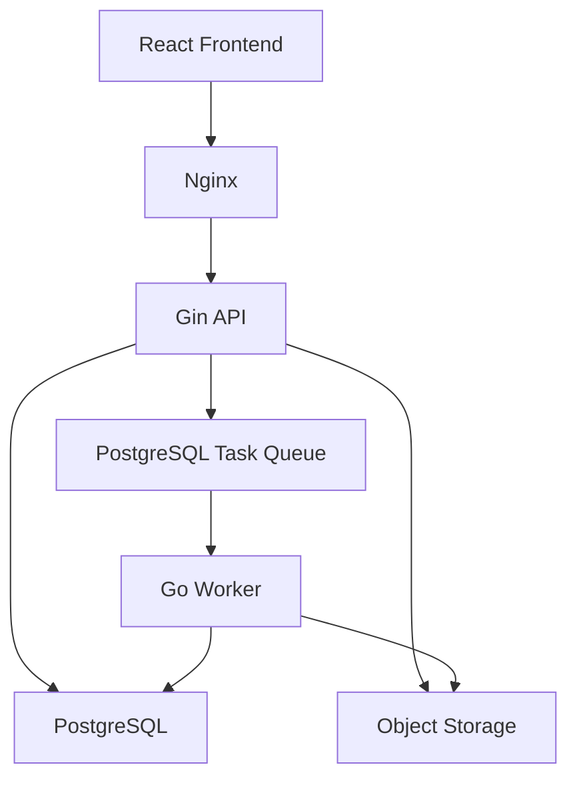

# Component Repo Go 迁移路线与实施计划

> 状态：G0～G7 completed；G8 in progress / Component Repo Go-only runtime established
> 更新日期：2026-08-24
> 原则：[go_backend_migration_principles.md](./go_backend_migration_principles.md)
> 进度：[go_migration_progress.md](./go_migration_progress.md)
> API 契约：[api.md](./api.md)
> G2 schema 决策：[go_component_schema_baseline.md](./go_component_schema_baseline.md)
> G8 前端切换清单：[go_g8_frontend_cutover_inventory.md](./go_g8_frontend_cutover_inventory.md)

## 1. 范围与假设

本计划将 Component Repo 的公共 API、事务编排、数据访问、对象存储编排和任务管理迁移到 Go。

当前项目没有生产流量，因此：

- 不保留旧 FastAPI 组件 API 兼容性。
- 前端直接切换到新 `/api/v1` 契约。
- 开发数据库允许通过单独确认后的 reset/reseed 采用新 schema baseline。
- 新实现不支持 MySQL。
- Component Repo 的目标运行时为 Go-only；Python 不承载迁移完成后的公共 API 或任务执行。
- `component.relations.detect` 已迁移为 Go Worker；原 Python Worker/adapter/launcher 已删除。

不在首轮范围：

- 迁移 Component Repo 之外的 Python 业务域；
- 拆分组件微服务或开发业务网关；
- 引入独立消息中间件；
- 生产灰度、双写和历史客户端兼容。

## 2. 目标运行架构



第一阶段可以单实例运行，但 API 和 Worker 从代码结构上必须独立启动、独立扩容。

## 3. 目标工程结构

```text
backend-go/
├── cmd/
│   ├── api/main.go
│   ├── worker/main.go
│   └── migrate/main.go
├── internal/
│   ├── component/
│   │   ├── handler.go
│   │   ├── service.go
│   │   ├── dto.go
│   │   └── errors.go
│   ├── task/
│   ├── auth/
│   ├── storage/
│   ├── i18n/
│   ├── config/
│   └── observability/
├── db/
│   ├── migrations/
│   ├── queries/
│   └── generated/
├── sqlc.yaml
├── go.mod
└── Makefile
```

## 4. 目标领域与数据边界

### 4.1 核心表组

组件目录与版本：

```text
components
component_versions
component_translations
```

个人仓库：

```text
component_groups
component_group_memberships
component_subscriptions
```

导入与资产：

```text
artifacts
component_imports
component_scene_snapshots
```

结构理解：

```text
component_candidates
component_relation_candidates
component_assembly_relations
component_interfaces
component_validation_reports
```

任务：

```text
tasks
task_events
outbox_events
```

首轮 schema 可以保留稳定扩展字段为 `jsonb`，但所有权、状态、版本关系、artifact 关系、任务 lease、错误 code 和 locale/timezone 必须为显式列。

### 4.2 不变量

- 原始 `.io/.ldr/.mpd` artifact 不可覆盖，必须保存 SHA-256。
- 发布后的 ComponentVersion 结构不可修改。
- ComponentGroup 是用户视图，不复制或改变 Component 所有权。
- 根分组不保存本地化名称。
- 用户内容保留原文和 `contentLocale`。
- 官方 Component/Part 只读取 `reviewed` 翻译。
- 场景快照是结构权威数据，GLB 是可重建派生数据。
- Transform 不得被连接识别自动改写。
- 单容量 connector 不得被多个已确认关系占用。

## 5. 新 API 草案

### 5.1 Component 与版本

```text
GET    /api/v1/components
POST   /api/v1/components
GET    /api/v1/components/:componentId
PATCH  /api/v1/components/:componentId
DELETE /api/v1/components/:componentId

GET    /api/v1/components/:componentId/versions
POST   /api/v1/components/:componentId/versions
GET    /api/v1/component-versions/:versionId
DELETE /api/v1/component-versions/:versionId
POST   /api/v1/component-versions/:versionId/publish
POST   /api/v1/component-versions/:versionId/deprecate
POST   /api/v1/component-versions/:versionId/archive
GET    /api/v1/component-versions/:versionId/parts
GET    /api/v1/component-versions/:versionId/source
```

### 5.2 分组与订阅

```text
GET    /api/v1/component-groups
POST   /api/v1/component-groups
PATCH  /api/v1/component-groups/:groupId
DELETE /api/v1/component-groups/:groupId
POST   /api/v1/component-groups/:groupId/move

GET    /api/v1/component-groups/:groupId/components
POST   /api/v1/component-groups/:groupId/components
DELETE /api/v1/component-groups/:groupId/components/:componentId

PUT    /api/v1/components/:componentId/subscription
DELETE /api/v1/components/:componentId/subscription
```

### 5.3 导入、候选和任务

```text
POST   /api/v1/component-imports/upload-sessions
POST   /api/v1/component-imports/upload-sessions/:sessionId/complete
GET    /api/v1/component-imports/:importId

GET    /api/v1/component-candidates/:candidateId
GET    /api/v1/component-candidates/:candidateId/relations
POST   /api/v1/component-candidates/:candidateId/relations/detect
POST   /api/v1/component-candidates/:candidateId/relations/:relationId/confirm
POST   /api/v1/component-candidates/:candidateId/relations/:relationId/reject
GET    /api/v1/component-candidates/:candidateId/connectors
POST   /api/v1/component-candidates/:candidateId/validate

GET    /api/v1/tasks/:taskId
POST   /api/v1/tasks/:taskId/cancel
```

上传完成返回 `202 Accepted`：

```json
{
  "importId": "...",
  "taskId": "...",
  "status": "queued"
}
```

`202` 是上传写交互的终点，不是产物就绪信号。Go API 创建会话时生成并持久化可信
owner-scoped Storage key；浏览器只能使用当前用户 JWT 和 API 返回的精确目标直传 Storage，不能自行
指定 key。Storage RLS 只允许仍为 pending、未过期且属于 actor 的 upload session key。complete 确认
对象 metadata 并原子建立持久处理链；后续 verify、解析/BOM 和整体 GLB 生成全部由 Go Worker 推进。
普通上传流程不得要求前端再调用 Preview materialize mutation。

前端上传弹窗只等待 upload complete；收到 `202` 后立即关闭并导航到 `importId` 状态页。状态页使用
`processing | ready | failed` 的聚合投影恢复页面：只有 BOM 已持久化且整体 GLB Artifact 已生成、
验证并可读取时才进入 `ready`。当前由 Import 与 Version Preview 的已有持久字段投影该状态，但不能
把 parse task 单独 `succeeded` 解释为可预览，也不得在上传弹窗内等待 Worker 完成。

Import DTO 已提供 `processingStatus` 与 `previewTaskId`；本计划不要求保持旧开发字段兼容。

创建 ComponentVersion 时，客户端只提交 `componentCandidateId` 和版本展示元数据。
`sourceArtifactId`、`exchangeArtifactId`、`sceneSnapshotId`、`parserVersion`、
`partLibraryVersionId`、`interfaceSignature`、`structureHash` 和 `geometryHash`
必须由服务端沿 Candidate -> SceneSnapshot -> Import -> Artifact 的已验证来源链取得，
客户端不得分别指定。解析和这些签名/hash 的计算继续由异步 Worker 完成；Gin
只执行有界的来源查询与版本事务写入。

## 6. 任务类型与 Worker 路由

首批任务类型：

| taskType | 当前执行者 | 目标执行者 | 状态/目标 |
|---|---|---|---|
| `component.import.parse` | Go Worker | Go Worker | 已迁移；解析 Studio/LDraw、写入 Snapshot/Candidate/Draft |
| `component.relations.detect` | Go Worker | Go Worker | 已迁移；冻结 Part Library connector 数据并原子物化关系/接口 |
| `component.validate` | Go Worker | Go Worker | 用户显式触发的可选结构化质量验证，不阻塞发布 |
| `component.preview.materialize` | Go Worker | Go Worker | 生成编排与对象存储写入 |
| `component.part_preview.materialize` | Go Worker | Go Worker | Part GLB 物化 |
| `component.part_preview.prebuild` | Go Worker | Go Worker | 受控、可恢复的全库 Part meshopt GLB 预生成 |
| `component.artifact.verify` | Go Worker | Go Worker | 大小、hash 和元数据校验 |

不得为 Component Repo 新增 Python task type。

## 7. 迁移阶段

### G0：原则、路线与工程决策

目标：固定迁移方向和执行边界。

交付：

- Go 后端迁移原则；
- Component Repo 路线图；
- 进度台账；
- 仓库级代理必读规则。

验收：文档互相链接，进度只记录事实，不把计划标记为完成。

### G1：Go 工程骨架

目标：建立可运行、可测试、可生成代码的 Go 模块。

交付：

- `backend-go/go.mod`；
- Gin API 与 `/health/live`、`/health/ready`；
- 配置加载与启动校验；
- 结构化日志、trace ID、recovery、超时和统一错误响应；
- pgxpool 初始化、Ping 和优雅关闭；
- sqlc 与 Goose 配置；
- API、Worker、migration 独立入口；
- 基础单元测试和 CI 命令。

验收：

- API 和 Worker 可独立启动与关闭；
- 数据库不可用时 readiness 失败；
- panic 不泄露堆栈到响应；
- `sqlc generate` 和 migration dry run 可执行。

### G2：PostgreSQL schema baseline

目标：建立由 Go 工程拥有的干净数据库基线。

交付：

- 清点现有 Component Repo 表、约束、索引和 RLS；
- 确定保留、合并、重命名和删除项；
- 编写 Goose baseline；
- 编写 sqlc query schema 输入；
- PostgreSQL 集成测试；
- 将 `component_repo` schema 的 authority 从 Alembic 边界中剥离并交给 Goose；legacy `public` 域及 provider-owned Supabase `storage` policy 暂由 Alembic 管理；
- 开发数据 reset/reseed runbook。

验收：

- 空 PostgreSQL 可以从零升级到 head；
- schema 与 sqlc 生成结果一致；
- API/Worker 启动不执行 DDL；
- 交接后不再新增或修改任何触及 `component_repo` 的 Alembic revision。

注意：任何实际 drop/reset 必须在执行前确认数据库目标，不能仅凭本计划自动执行。

### G3：组件目录、版本和分组

目标：完成不依赖重计算的组件主业务闭环。

交付：

- Component CRUD；
- ComponentVersion 查询、创建草稿和生命周期；
- ComponentGroup 树、移动和成员关系；
- ComponentSubscription；
- owner/actor 授权；
- 官方翻译选择和用户 `contentLocale`；
- 列表过滤、分页和稳定排序。

验收：

- 所有写操作具有事务测试；
- 跨用户查询和写入被拒绝；
- 分组循环、深度、同级唯一性和排序约束通过；
- 发布版本不可变；
- API 错误只有 `code + params + traceId`。

### G4：Artifact 与上传会话

目标：让 Gin 可靠管理源文件元数据和客户端直传。

交付：

- Storage interface 与 Supabase/S3-compatible adapter；
- 上传会话；
- 服务端生成 owner-scoped object key；
- Storage INSERT RLS 只接受 API 已登记的 pending、未过期 upload session 精确 key；
- HEAD/metadata 校验；
- artifact immutable 规则；
- 下载/签名 URL；
- 部分失败补偿和过期上传清理。
- 禁止 authenticated 客户端删除 Artifact 对象，由服务端 Worker 使用专用凭据执行失败补偿与过期清理。

验收：

- 客户端不能指定可信完整 Storage key；
- 上传完成不重复下载正文；
- hash 在唯一必要正文读取中验证；
- 原始 artifact 不被派生 artifact 替代或覆盖。
- source artifact 的结构字段与终态校验状态受数据库约束保护，且 authenticated Storage policy 不授予删除权限。

### G5：持久化任务系统

目标：所有组件长任务脱离 API 进程。

交付：

- `task_jobs`、`tasks`、`task_events`、`outbox_events`；
- 创建、领取、续租、完成、失败、取消和重试；
- 通用 Logical Job / Execution / Attempt 模型、确定性 input hash 与最大尝试次数；
- progress/error `code + params`；
- locale/timezone 冻结；
- Go Worker 执行框架；
- 语言无关 Worker 消费协议，详见 [go_task_protocol.md](./go_task_protocol.md)；该协议允许迁移期
  对照验收，不改变 Component Repo Go-only 目标。

验收：

- Worker 崩溃后 lease 到期可恢复；
- 并发提交相同 Logical Job 只产生一个 active Execution；
- queued/running 和成功 Execution 可复用，failed/cancelled 后创建同一 Job 的下一次 Execution；
- 任务重试不重复创建 artifact 或版本；
- API 重启不丢失任务。

### G6：组件导入、解析与候选流程

目标：完成上传到 SceneSnapshot、BOM、Candidate 和 Draft Version 的异步闭环，并为上传主链的
整体 GLB 阶段建立不依赖浏览器的持久 continuation。

交付：

- upload complete 原子创建 import 与 parse task；
- Go parser Worker handler；
- scene snapshot、BOM 和 parse issues 写入；
- Candidate 与 Draft ComponentVersion；Worker 在 Candidate 上物化版本创建所需的
  interface/structure/geometry 签名，API 不同步重新解析或计算；
- parse 成功后由服务端持久、幂等地确保对应 Draft Version 的 Preview Logical Job 已调度；
- 结构化失败和重试；
- parser version 与 part library version 冻结。

验收：

- API 请求不执行文件解析；
- 同一 import 重试不会覆盖历史快照；
- 用户切换语言不改变任务上下文；
- parse issue 不保存最终译文或异常正文。
- 关闭浏览器不影响 parse 后的 Preview Task 创建与执行；parse 重试不重复创建 Logical Job。

### G7：关系、接口、校验和预览

目标：补齐 Component Repo 工作台所需的结构理解能力。

交付：

- relation detection task；
- confirm/reject transaction；
- free connector 与 external interface；
- validation task/report；
- version-addressed GLB materialize task；
- 普通上传由服务端自动串联 Preview Task；显式 materialize API 只用于缓存重建、失败恢复或受控维护，
  不是前端正常上传路径的一部分；
- signed preview URL 和 locale-aware Part BOM 分离加载。
- relation、validation、preview 都使用业务 logical key、权威输入 hash 和算法版本接入 G5 通用调度模型；preview generation 只表达派生缓存物化代次，不再承担任务去重职责。

验收：

- Transform 不被检测逻辑修改；
- connector capacity 和关系唯一性由数据库/事务保证；
- owner 可直接发布 Draft；验证是 Draft/Published 上可选的异步质量报告，失败不阻止或撤销发布；
- Component 详情页可显式触发验证，并在当前报告通过时展示已通过状态；
- GET 不隐式生成 GLB；
- 缓存丢失可以幂等重建。
- Preview 失败不回滚已经成功的 source Artifact、SceneSnapshot、BOM、Candidate 或 Draft Version；
  上传聚合状态为 failed，前端仍不得展示预览。
- 冻结 Part Library 中 geometry 为 `failed/missing` 的 Part 不构成整件 Preview 失败：BOM 保留并返回
  `geometryStatus`，Worker 省略对应实例并生成 partial GLB；ready source 的缺失、哈希漂移或递归解析
  失败仍严格失败。
- 相同输入的 active/succeeded 计算被复用；终态失败或派生缓存丢失创建同一 Logical Job 的下一次 Execution。

### G8：前端切换与 Component Repo Python 删除

目标：完成 Component Repo 公共入口和异步执行权的 Go 所有权交接，使完整业务链路不依赖 Python 进程。

交付：

- 前端切换 `/api/v1`；
- Component 列表只使用 `draft/active` 生命周期，并提供 owner-scoped 全局 Import 历史与 Component 详情
  Import Tab；Import 的 `processing/ready/failed` 不进入 Component 状态筛选；
- 新任务轮询与错误渲染；
- 上传弹窗在 complete `202` 后立即退出；独立 Import 状态页只恢复/轮询聚合处理状态，在 BOM 与
  整体 GLB 同时 ready 前不挂载三维预览器，使用 typed semantic key 展示 processing 文案；
- Candidate 与详情页的 BOM 标注 geometry 为 `failed/missing` 的 Part；默认整体 GLB 可为有明确
  omissions 的 partial preview，Connector 数据仍由用户开关按需读取；
- Nginx 只转发组件 API 到 Gin；
- 删除 FastAPI Component Repo 路由、schema 和不再使用的服务；
- [x] 将 `component.relations.detect` 迁移为 Go Worker handler，以冻结 input hash、结构化结果和
  PostgreSQL 不变量做验收；
- [x] 删除 Component Repo Python Worker 入口、adapter 与仅服务这些入口的代码；
- 更新架构、启动脚本和开发文档。

验收：

- 前端组件完整流程只访问 Gin；普通上传流程在 `complete -> 202` 后不再发起解析或 Preview
  materialize mutation；
- Python 进程停止时，上传、解析、关系检测、审核、校验、发布、BOM 和预览完整链路仍可用；
- 仓库中不存在两套组件公共 API；
- Component Repo 不存在 Python task consumer 或新增 Python 功能入口；
- i18n、Go、前端和 PostgreSQL 集成测试通过。

## 8. 当前实施顺序

阶段依赖仍为：

```text
G0 -> G1 -> G2 -> G3 -> G4 -> G5 -> G6 -> G7 -> G8
```

G0～G7 已完成，当前不再按早期“先实施 G1”的建议执行。G8 的现行顺序是：保持 `/api/v1` 与
Go Worker Go-only 主链稳定，完成剩余真实浏览器/RLS 验收，删除仍挂载但前端已不依赖的 FastAPI
Component Repo 公共 router，最后收口部署、指标和告警。GLB 视觉精度与压缩作为版本化生成器后续
工作，不阻塞当前上传、BOM 和 partial preview 主链。

## 9. 验证矩阵

| 范围 | 必需验证 |
|---|---|
| Go 静态质量 | `gofmt`、`go vet`、`go test ./...` |
| sqlc | 生成结果无未提交漂移，query analysis 通过 |
| migration | 空库 upgrade、当前 head 校验、重复执行安全性 |
| PostgreSQL | 真实 PostgreSQL 集成测试，不以 SQLite 代替 |
| API | 成功、validation、授权、not found、conflict、internal error |
| 并发 | 发布、分组移动、任务领取、幂等上传/派生资产 |
| i18n | 错误 code、任务 code、官方翻译、用户内容和 locale/timezone |
| Storage | owner path、metadata、hash、签名 URL、部分失败清理 |
| 前端 | Component Repo 页面、任务轮询、错误本地化、文件上传 |

每阶段完成后在 [go_migration_progress.md](./go_migration_progress.md) 记录命令、结果、未完成项和下一步。

## 10. 当前实施切片

1. 保持上传 `202 -> Import processing page -> Worker continuation -> ready` 主链稳定；
2. 保持 BOM 完整、逐 Part geometry 状态和 partial GLB omissions 可诊断；
3. 完成 G8 剩余真实授权/双语言/维护矩阵；
4. 删除旧 FastAPI Component Repo 公共 router 和只服务旧接口的代码；
5. 以独立 generator version 推进 GLB 视觉精度与压缩，不恢复 Python runtime。
